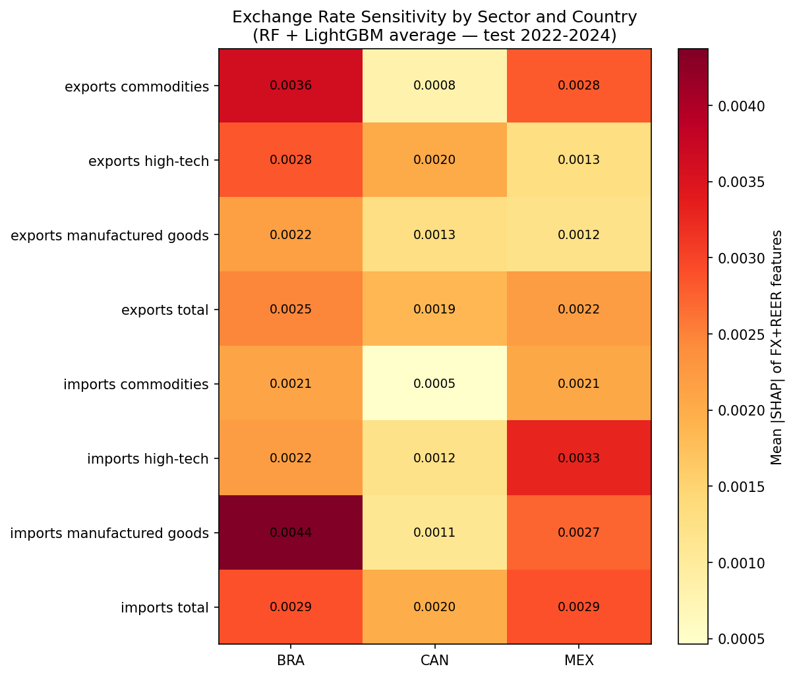

# US Trade Flow Forecasting

Predicting how exchange rate swings affect US bilateral trade with Canada, Mexico, and Brazil — comparing ARIMA, Random Forest, and LightGBM across 24 series.

**Period:** January 2010 – December 2024 · **Forecast horizon:** 36 months (2022–2024)  
**Target:** 3 countries × 2 directions (exports/imports) × 4 sectors = 24 series

---

## What this does

The pipeline takes monthly trade flow data (UN Comtrade) and macroeconomic indicators (FRED) and produces out-of-sample forecasts across 24 series. Diebold-Mariano tests with Harvey's small-sample correction compare model accuracy. SHAP values quantify how much exchange rate features drive each model's predictions.

The five notebooks follow CRISP-DM end-to-end:

| Notebook | Phase | What it covers |
|----------|-------|----------------|
| `01_data_collection.ipynb` | Data Understanding | Pulls exchange rates and macro indicators from FRED via API |
| `02_eda.ipynb` | Data Understanding | Stationarity tests (ADF/KPSS), correlation analysis, seasonality decomposition |
| `03_data_preparation.ipynb` | Data Preparation | Feature engineering: lagged FX, rolling volatility, REER, sectoral series construction |
| `04_modeling.ipynb` | Modeling | ARIMA walk-forward, Random Forest and LightGBM direct 36-step, grid search tuning |
| `05_evaluation.ipynb` | Evaluation | MAPE/MAE/RMSE, Diebold-Mariano, Friedman + Wilcoxon + Bonferroni, SHAP dual-model analysis |

---

## Key results

Random Forest achieved the best median MAPE across 24 series (0.94%), outperforming LightGBM (1.03%) and ARIMA (1.41%). Diebold-Mariano tests confirmed that both ML models beat ARIMA on 75–83% of series.

SHAP shows exchange rate features account for 30–45% of RF predictions and are most influential for Brazil — the country with no preferential trade agreement with the US and the highest FX volatility in the sample.




All figures are in [results/figures/](results/figures/).

---

## Data sources

| Source | What | Files |
|--------|------|-------|
| [FRED](https://fred.stlouisfed.org/) | Exchange rates, GDP, CPI, industrial production, interest rates | `data/raw/fred_*.csv` |
| [UN Comtrade](https://comtradeplus.un.org/) | Monthly and annual trade flows by HS2 sector | `data/raw/comtrade_*.csv` |
| [World Bank](https://data.worldbank.org/) | Supplemental country indicators | `data/raw/worldbank_indicators.csv` |

Processed datasets (one per country + combined) are in `data/processed/`. See [data/codebook/variable-catalogue.md](data/codebook/variable-catalogue.md) for the full variable list and transformation decisions.

---

## Reproduce

```bash
# 1. Install dependencies
pip install -r requirements.txt

# 2. Set your FRED API key
cp .env.example .env
# edit .env: FRED_API_KEY=your_key_here

# 3. Run notebooks in order
jupyter notebook
```

Each notebook saves its outputs to `data/processed/`, `models/`, and `results/` — the next one picks up from there.

> **Note:** Notebook 01 requires a free FRED API key. Notebooks 03–05 can run entirely from the processed CSVs in `data/processed/`.

---

## Project structure

```
us-trade-forecasting/
├── notebooks/           # Five CRISP-DM phase notebooks
├── data/
│   ├── raw/             # Original API pulls (not versioned — run notebook 01)
│   ├── processed/       # Clean, feature-engineered datasets
│   └── codebook/        # Variable catalogue and glossary
├── models/              # Trained model files — ARIMA, RF, LightGBM (.pkl)
├── results/
│   ├── figures/         # Evaluation and SHAP figures
│   └── forecasts/       # Per-series forecast CSVs
└── src/                 # Helper modules imported by notebooks
```

---

## Dependencies

Python 3.10+. Core packages:

```
pandas · numpy · scikit-learn · lightgbm · statsmodels · shap · fredapi · matplotlib · seaborn
```

Full list in `requirements.txt`.

---

## Author

Francisco Giordano Rigon — Information Systems, UNISINOS  
Advisor: Josiane Brietzke Porto, PhD

---

[MIT License](LICENSE)
